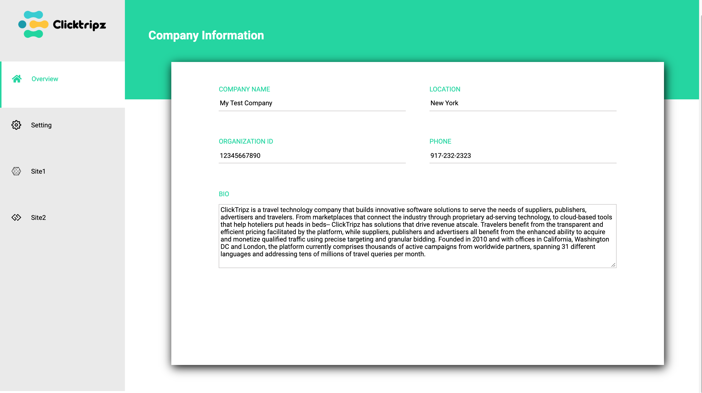
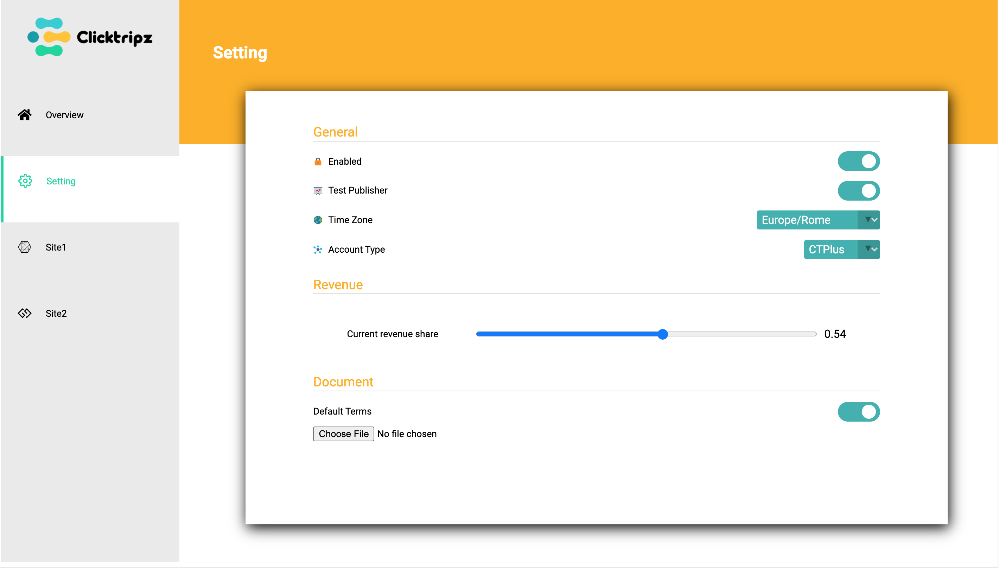
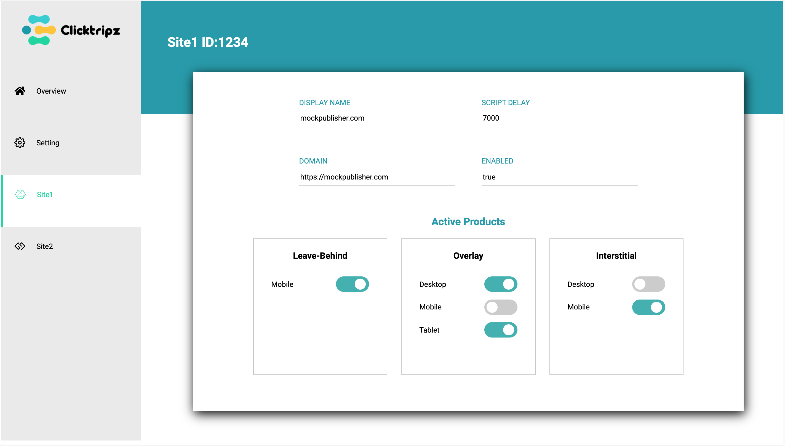
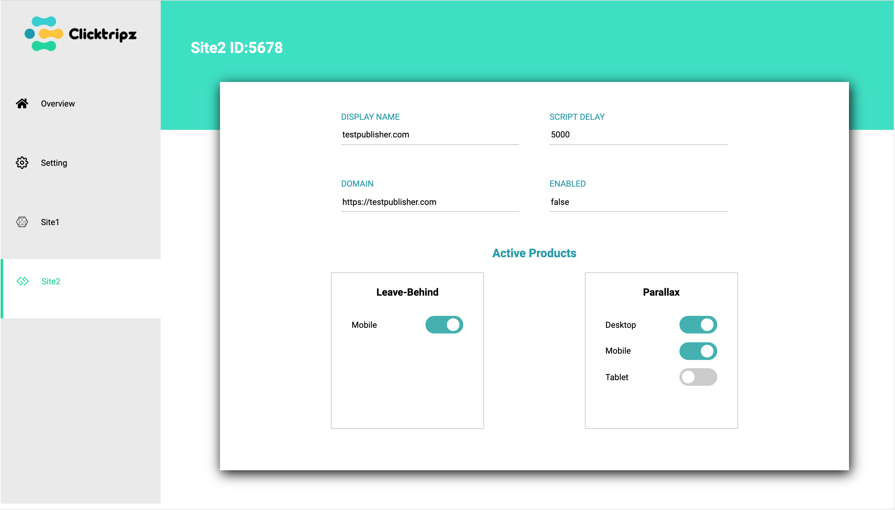

# ClickTripz Front-end Challenge

This project was created for ClickTripz, Front-end take-home assignment. 

## Tech Stack

- React 
- CSS/HTML
- JavaScript
- React Icons
- Git
- npm

## Features

There are 4 pages, each page presents in different colors and shows different content

   

## Getting Started

1. Fork and clone this repo, then npm install
2. Start this project: npm start

## Next Steps

The future of this project can work on the media screen design for different screen sizes. It currently only designs for laptop. Maybe can add media type of tablet and mobile.

